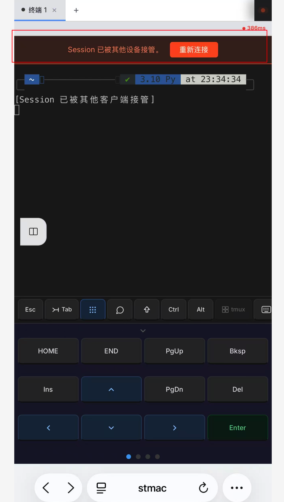
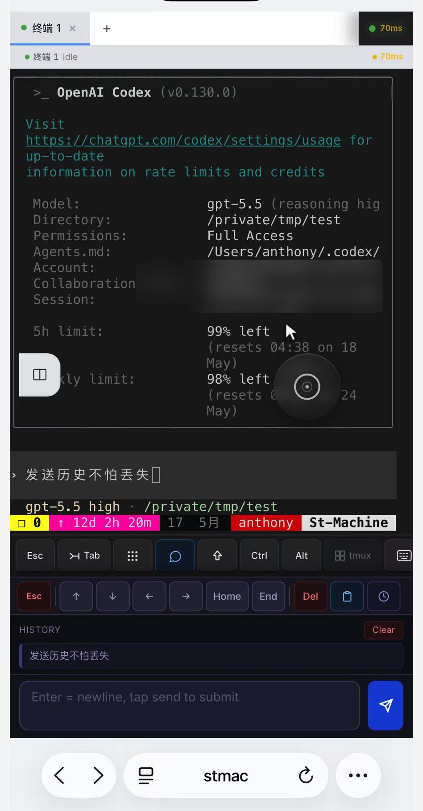
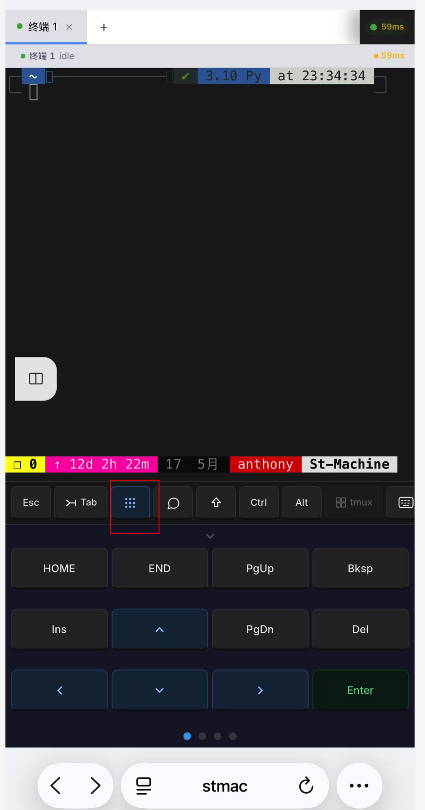
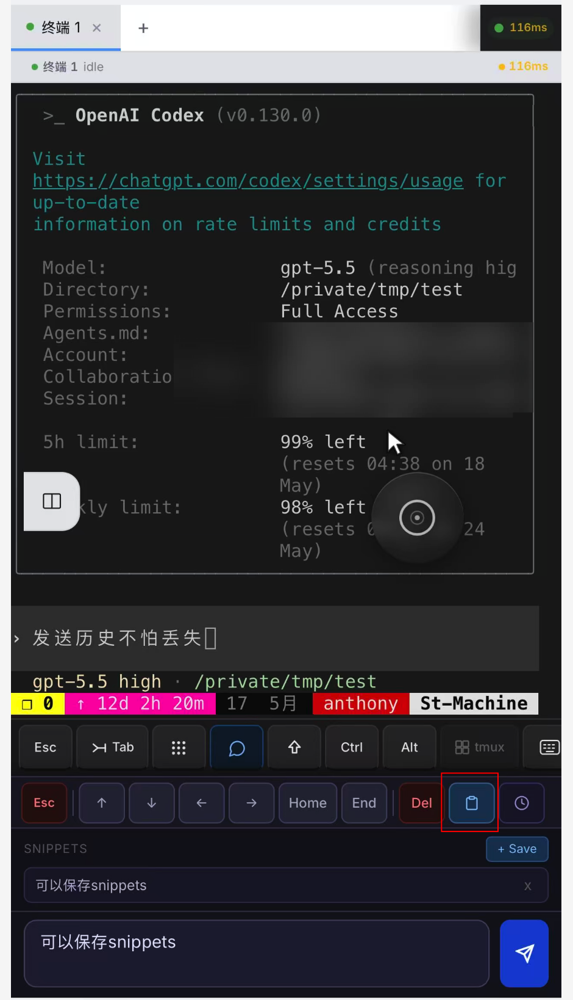
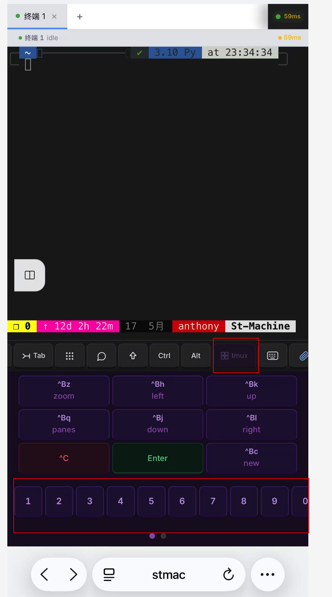
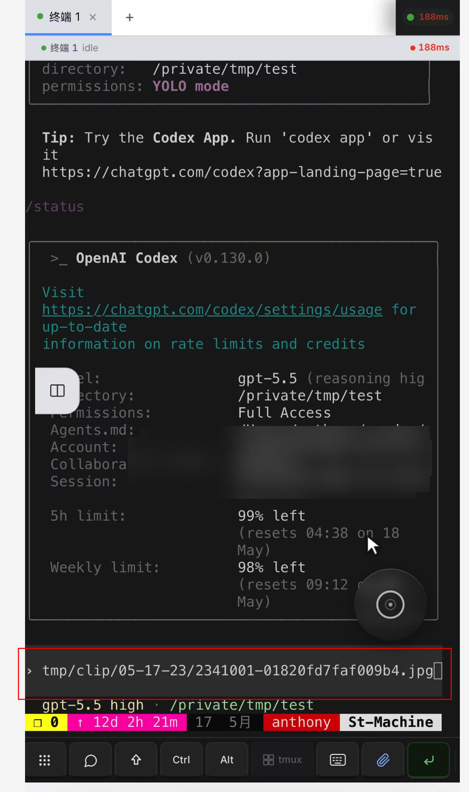
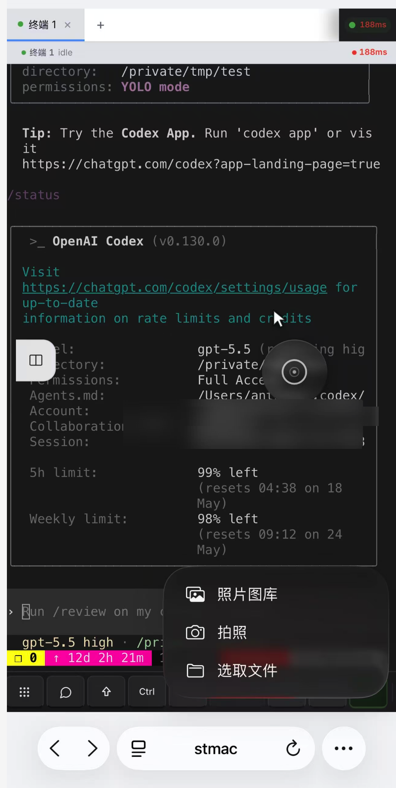

# deepwork-terminal

A standalone web terminal with authentication, Cloudflare tunnel support, and an embedded Vue frontend. Drop it into any Go application via a single HTTP handler.

## Features

- Full PTY terminal over WebSocket
- Session management with reconnect support
- Clipboard paste support
- Settings portal (workbench API)
- Optional Cloudflare Tunnel (auto-downloads `cloudflared`)
- Embedded Vue SPA — zero static file serving required
- Hook points for auth, session lifecycle, and shell customization

## Screenshots

### 会话接管与抢占 — 手机 + PC 随时切换

多端共享同一终端会话，手机和 PC 可随时接管或抢占控制权，无缝远程切换操作。



---

### Textarea 文本输入 — 历史不丢失

内置多行文本输入框，发送历史持久保留，复杂命令编辑更方便，告别误触清空的烦恼。



---

### 快捷键盘输入

针对移动端优化的快捷键盘面板，常用控制键一触即达（Ctrl、Esc、Tab、方向键等）。



---

### Snippets 片段管理 — 快捷输入

保存常用命令片段，点击即插入，减少重复输入，提升效率。



---

### tmux 专项面板 — 快捷切换 Pane

内置 tmux 集成面板，直观展示所有 pane，一键切换，无需记忆 tmux 快捷键。



---

### 截图 / 文件上传为图片 — PC 与移动端均支持

从 PC 浏览器或移动端上传截图和文件，自动转为图片链接，供 AI 工具（Codex / Claude）直接访问，快速排查问题。





## Quick Start (as a library)

```bash
go get github.com/brightman-ai/deepwork-terminal
```

```go
import terminal "github.com/brightman-ai/deepwork-terminal"

srv := terminal.New(terminal.DefaultConfig())
http.Handle("/terminal/", srv.Handler())
http.ListenAndServe(":8080", nil)
```

Or run the CLI directly:

```bash
go run ./cmd/dw-terminal
```

See [guide/](guide/) for full documentation.

## Build from source

### Go binary only (recommended for servers)

The frontend is **pre-built** and committed to the repo (`internal/spa/dist/`).
Building the binary requires only Go — no Node.js needed:

```bash
git clone https://github.com/brightman-ai/deepwork-terminal
cd deepwork-terminal
go build -o dw-terminal ./cmd/dw-terminal/
```

### Full build (frontend + Go)

If you modify the Vue frontend source (`frontend/src/`), rebuild and re-embed:

```bash
# Requires Node.js 18+ and npm
./build.sh
```

`build.sh` runs `npm install` + `vite build`, copies the output to `internal/spa/dist/`,
then compiles the Go binary. The updated `internal/spa/dist/` should be committed
alongside your frontend changes so others can build without Node.js.

> **Headless servers**: if `npm install` triggers a browser download (Playwright/Puppeteer
> postinstall), the script sets `PLAYWRIGHT_SKIP_BROWSER_DOWNLOAD=1` automatically.

## License

[MIT](LICENSE)
