# deepwork-terminal

**English** | [简体中文](README_CN.md)

A **mobile-first web terminal for watching and steering your AI coding agents** (Claude Code / Codex) — from your phone or a laptop on the go, reach and drive the desktop/laptop back home where the agent actually runs. With auth, Cloudflare tunnel, Web Push / WeChat notifications, and an embedded Vue frontend. Drop it into any Go application via a single HTTP handler.

## Why deepwork-terminal

You kick off a long refactor in Claude Code and close your laptop. On the way out it stalls on a `Proceed? [Y/n]` — and the rest of the run is wasted. **Agents are async, but you're mobile, and the terminal is pinned to one machine.**

deepwork-terminal moves that terminal — the agent's status, its output files, the `[Y/n]` prompt — onto your phone's browser, and pings you (Web Push **or** WeChat) when an agent actually needs you. Tap the notification, land on the exact session, reply, get back to your day.

Four details that actually change the experience:

1. **Remote screenshot paste** — `Ctrl/Cmd+V` a screenshot on your PC; it lands in the agent's current working directory and the relative path is injected straight into the command line. Mobile file/photo upload works too — and since the input box is just a normal field, multi-line text and your phone's **voice input** go straight to the agent.
2. **Watch agents from your phone** — install as a PWA for Web Push and tap to deep-link back to the exact session; WeChat (iLink official channel) as a backup; an agent status strip up top; a keyboard-aware viewport that never covers your input.
3. **tmux quick-keyboard bar** — one row of buttons for copy / split / switch pane / new session, with your live tmux prefix shown — no shortcuts to memorize. No tmux? You can still run multiple terminals, just without pane splits.
4. **Cross-session continuity** — a global upload index, input-history reuse, and a file drawer (image/text preview + fuzzy search) that follow you across sessions.

**Who it's for**: people who run agents heavily and step away from the desk often. **Not for**: someone who only codes in one window on one machine and never goes remote — you don't need this.

## Features

**Watch & steer AI coding agents**
- Live agent status (running / waiting / idle) for Claude Code & Codex, with per-session token & cost overview
- Notify on **Web Push (PWA)** and **WeChat (iLink official channel)** when an agent needs you — tap to deep-link back to the exact session
- Multi-device session takeover — switch between phone and PC mid-task

**Mobile-first terminal**
- Full PTY terminal over WebSocket, with reconnect
- Quick-keyboard bar for tmux (copy-mode, split / zoom / switch pane, new / list / detach session) — no shortcuts to memorize, dynamic prefix
- Paste a screenshot with `Ctrl/Cmd+V` → lands in the active pane's cwd, path injected into the terminal; mobile upload too
- Resource drawer: cross-session upload index, input-history reuse, image / text preview & fuzzy file search

**Deploy anywhere**
- Embedded Vue SPA — zero static file serving; ships as a single binary
- Optional Cloudflare Tunnel (auto-downloads `cloudflared`)
- Hook points for auth, session lifecycle, and shell customization

## Install

Fastest path — a prebuilt binary, **no Go or Node required**:

```bash
curl -fsSL https://raw.githubusercontent.com/brightman-ai/deepwork-terminal/main/install.sh | sh
```

Installs `dw-terminal` to `~/.local/bin` for **Linux** (amd64/arm64) and **macOS** (universal). On **WSL**, this is the right path — it just works. Pin a version or change the directory:

```bash
curl -fsSL https://raw.githubusercontent.com/brightman-ai/deepwork-terminal/main/install.sh | sh -s -- --version=v0.5.1 --dir=/usr/local/bin
```

### Homebrew (macOS / Linux)

```bash
brew install brightman-ai/tap/dw-terminal
```

### Go (developers, Go ≥ 1.26)

```bash
go install github.com/brightman-ai/deepwork-terminal/cmd/dw-terminal@latest
```

> **Slow or blocked network?** Set a proxy so module + Go-toolchain downloads succeed
> (`./build.sh` and `install.sh --from-source` already default to this):
> ```bash
> GOPROXY=https://goproxy.cn,direct go install github.com/brightman-ai/deepwork-terminal/cmd/dw-terminal@latest
> ```

No Go installed but want a source build? The installer can bootstrap the latest stable Go:

```bash
curl -fsSL https://raw.githubusercontent.com/brightman-ai/deepwork-terminal/main/install.sh | sh -s -- --from-source --install-go
```

### Manual download

Grab a tarball from the [Releases page](https://github.com/brightman-ai/deepwork-terminal/releases) and put `dw-terminal` on your `PATH`.

### Verify & run

```bash
dw-terminal --version
dw-terminal --addr :8022
```

**Platform notes**

- **Linux / WSL** — one Linux binary covers both. On WSL2 a Windows browser reaches the server at `http://localhost:<port>`.
- **macOS** — release binaries are signed with a Developer ID and notarized, so Gatekeeper allows them. (Homebrew and the install script also clear the quarantine flag as a fallback.)

## Screenshots

### Standard view — tmux panes + quick-key toolbar

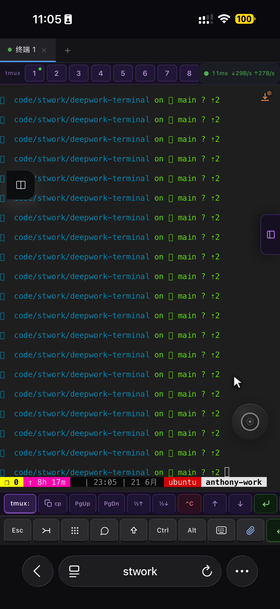

---

### Paste, type, or speak to the agent

`Ctrl/Cmd+V` a screenshot and the relative path is injected. The input box is also a normal field, so multi-line text and your phone's voice input go straight in.

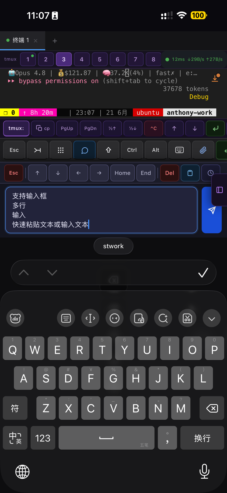

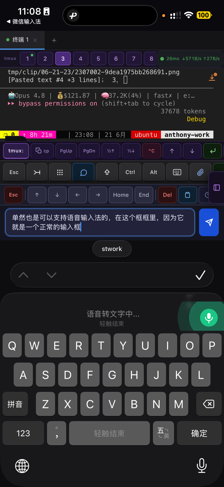

---

### Watch agents from your phone — multi-channel notify

Push "an agent is waiting" to wherever you already look — WeChat / Feishu / WeCom / DingTalk.

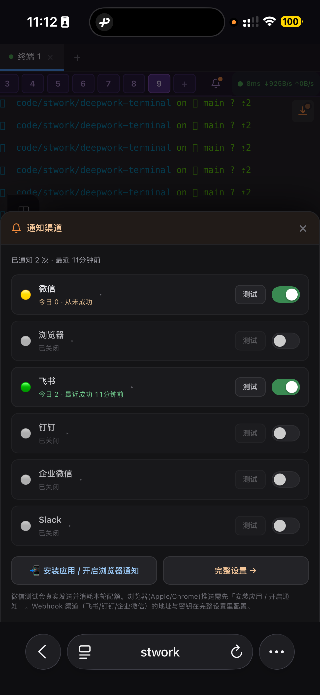

WeChat (iLink) quota: each message you send buys ~10 pushes; reply anything to refresh.

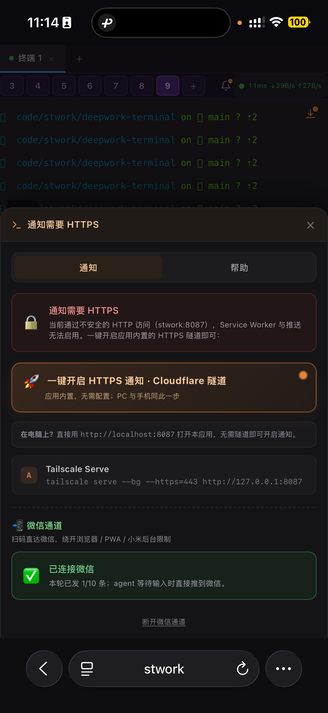

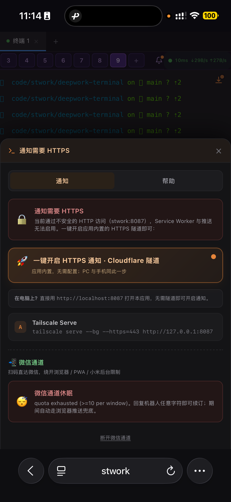

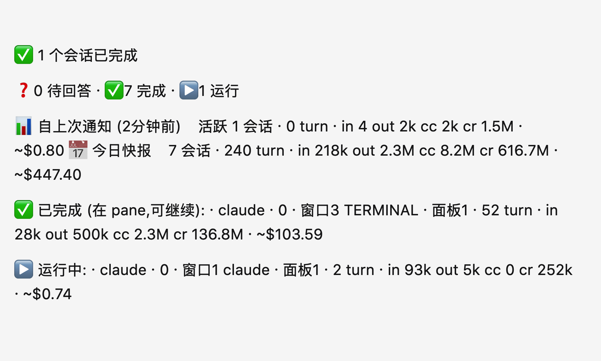

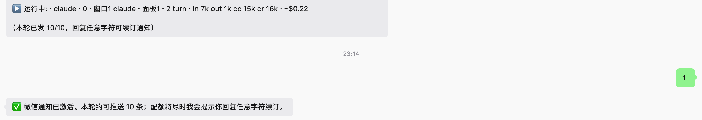

A status strip up top shows each session's state plus connection latency.

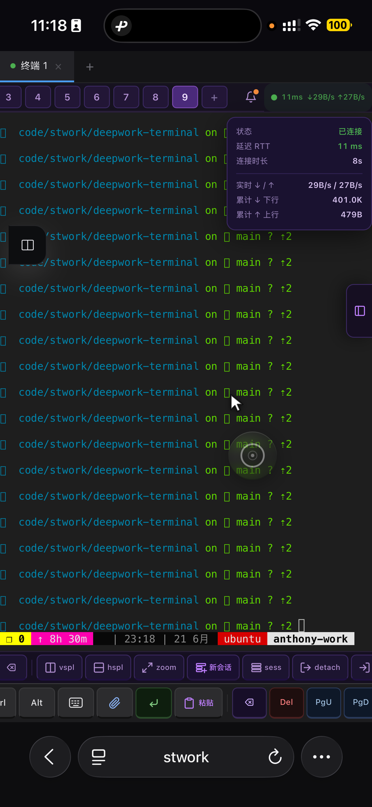

---

### tmux without the shortcuts

Two toolbars — one for tmux (panes / sessions), one general — with your live prefix shown. No tmux? Multiple terminals still work.

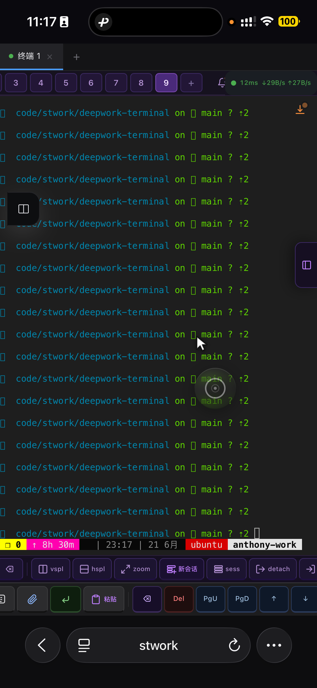

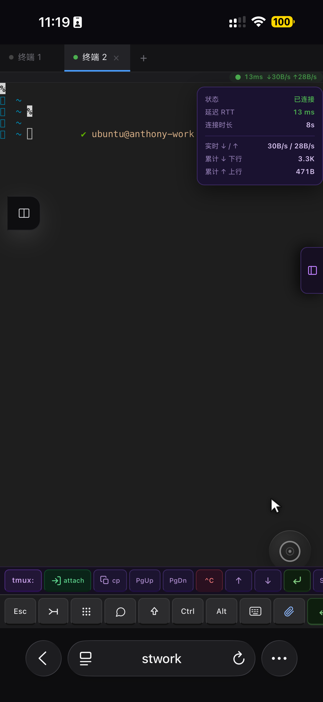

---

### Cross-session continuity — uploads, history, file drawer

Past uploads and the prompts you actually typed are reusable from any new session; the file drawer browses the tree and previews files in the browser.

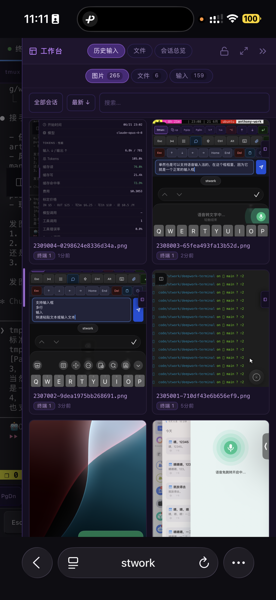

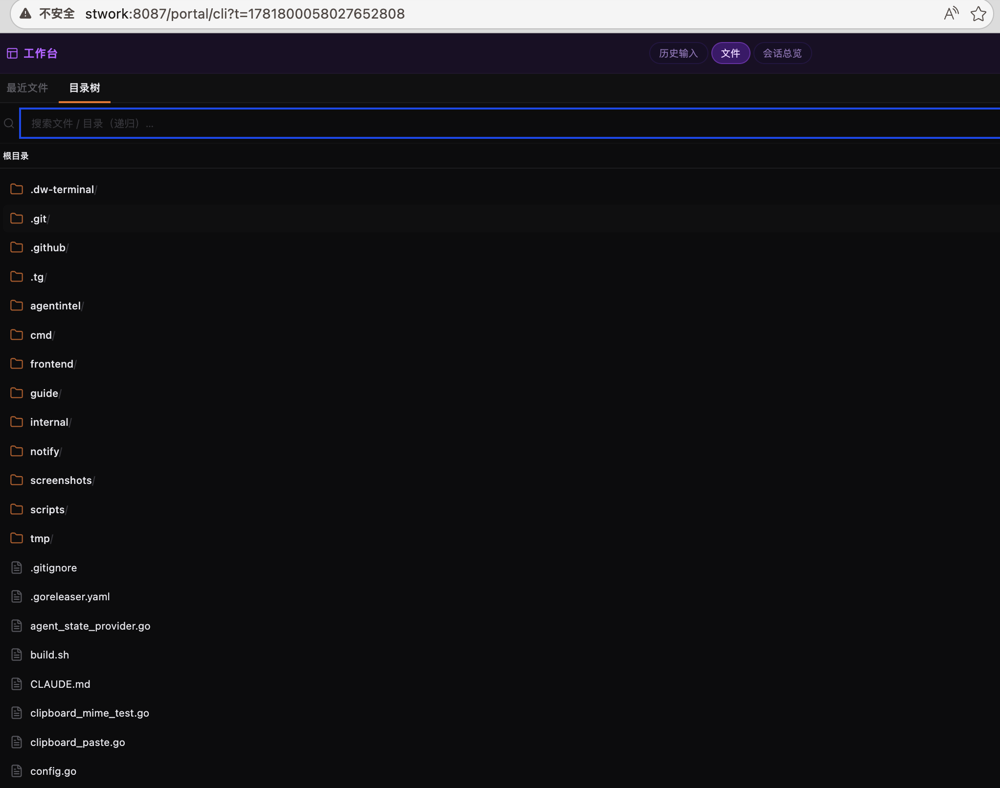

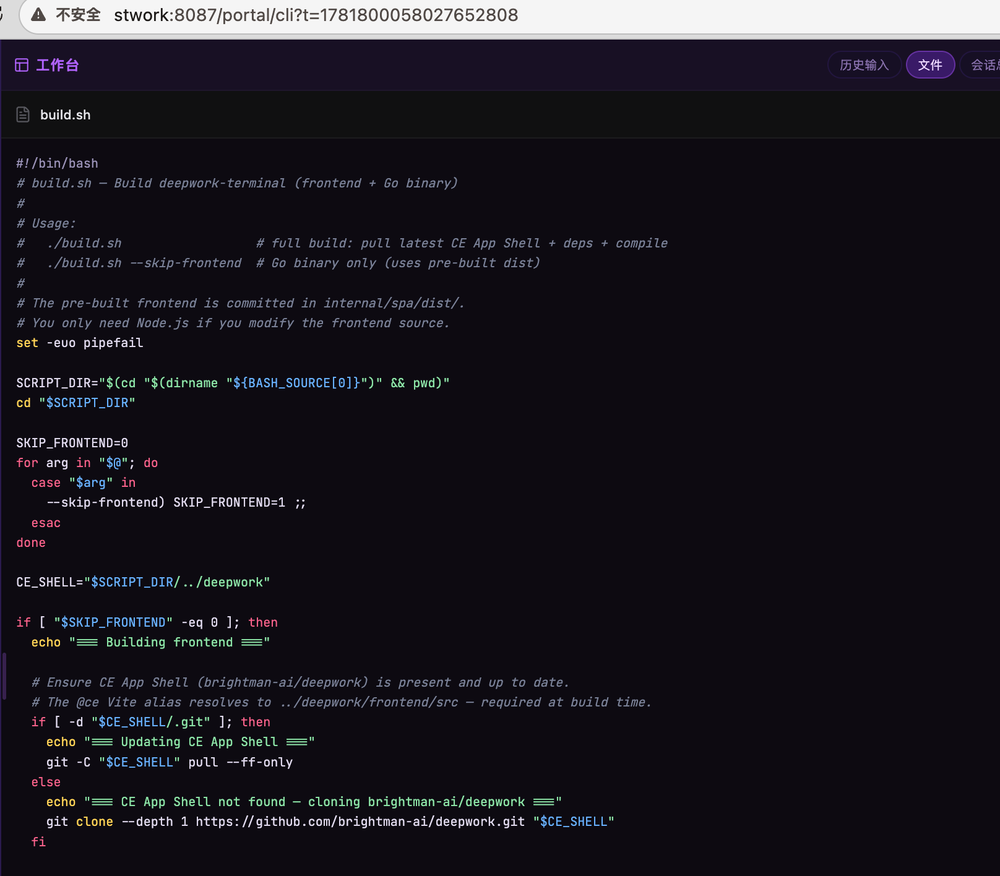

---

### More

Per-session token & cost overview; phone and PC share one session with takeover.

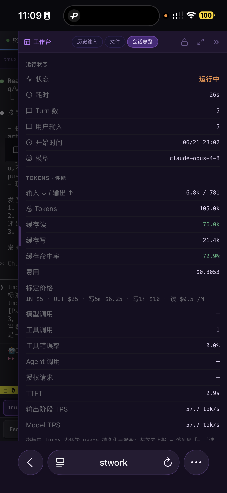

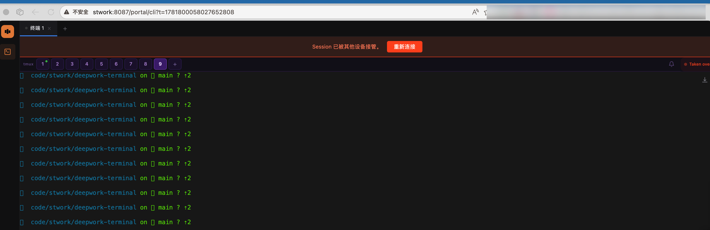

## 🔔 Notifications setup

When an agent needs you (waiting on `[Y/n]`, or done), deepwork-terminal pushes to any enabled channel:

| Channel | Default | Credential |
|---------|:------:|------------|
| WeChat (iLink) | on | scan-to-login |
| Browser Web Push (PWA) | on | grant permission |
| Feishu / Lark | off | webhook URL + secret (sign) |
| DingTalk | off | webhook URL + secret (sign) |
| WeCom (企业微信) | off | webhook URL (key in URL) |
| Slack | off | webhook URL |

Everything is configured in **Settings → Notifications**. Each channel has an **enable toggle**, a **配置 Webhook** form (URL + optional secret), and a **测试 (Test)** button that fires a *real* message and echoes the honest backend result. URLs/secrets are encrypted at rest and redacted in the UI (secret is write-only).

To get each webhook URL:

### Feishu / Lark
1. In a group: **Settings → Group Bots → Add Bot → Custom Bot**.
2. Security: choose **签名校验 (Signature verification)** and copy the **secret**.
3. Copy the **Webhook URL** (`https://open.feishu.cn/open-apis/bot/v2/hook/…`).
4. App → **配置 Webhook** → paste **URL + Secret** → **保存** → enable → **测试**.
   - Sign mismatch returns `19021` — recheck the secret. (If you picked "keyword" mode instead, the message must contain that keyword — signature mode is recommended.)

### 🔔 DingTalk
1. Group → **Settings → Group Assistant → Add Bot → Custom**.
2. Security: choose **加签 (Additional signature)** and copy the secret (starts with `SEC`).
3. Copy the Webhook URL (`https://oapi.dingtalk.com/robot/send?access_token=…`).
4. App → paste **URL + Secret (加签)** → **保存** → enable → **测试**.
   - Sign error → `310000 sign not match`. Avoid "keyword" mode (messages may be rejected).

### WeCom (企业微信)
1. Group → **… → Group Bots → Add → Create**.
2. Copy the Webhook URL (`https://qyapi.weixin.qq.com/cgi-bin/webhook/send?key=…`). The `key` in the URL is the credential — **no secret needed**.
3. App → paste **URL** (leave Secret blank) → **保存** → enable → **测试**.
   - `93000` → the URL/key is wrong, or the bot was removed from the group.

### Slack
1. Create an incoming webhook: **api.slack.com/apps → Create New App → Incoming Webhooks → Activate → Add New Webhook to Workspace**, then pick a channel.
2. Copy the Webhook URL (`https://hooks.slack.com/services/…`). The URL is the credential — **no secret needed**.
3. App → paste **URL** (leave Secret blank) → **保存** → enable → **测试**.
   - Success returns `ok`; a malformed request returns `invalid_payload`. The server must be able to reach `hooks.slack.com` (may need a proxy in some regions).

## Limitations (honest)

A project that only sells itself isn't worth trusting — a few boundaries up front:

- **No native app** — it's web-first (PWA), not an App Store application; iOS Web Push has platform caveats.
- **Early-stage** — few stars yet; ecosystem, docs, and community are all early.
- **Local-only** — it's a remote control for the machine the agent runs on, not a cloud agent-scheduler. You can still reach it over HTTPS from anywhere via the built-in Cloudflare Tunnel.

## Quick Start (as a library)

```bash
go get github.com/brightman-ai/deepwork-terminal
```

```go
import terminal "github.com/brightman-ai/deepwork-terminal"

srv := terminal.New(terminal.DefaultConfig())
http.Handle("/terminal/", srv.Handler())
http.ListenAndServe(":8080", nil)
```

Or run the CLI directly:

```bash
go run ./cmd/dw-terminal
```

See [guide/](guide/) for full documentation.

## Build from source

### First time or update to latest (recommended)

```bash
git clone https://github.com/brightman-ai/deepwork-terminal
cd deepwork-terminal
./build.sh
```

`build.sh` handles everything in one step:

1. Clones (or pulls to latest) the CE App Shell (`brightman-ai/deepwork`) into a sibling directory
2. Runs `npm install` to pick up any new frontend dependencies
3. Builds the Vue frontend and embeds it into `internal/spa/dist/`
4. Downloads any new Go module dependencies (`go mod download`)
5. Compiles the Go binary → `./dw-terminal`

To update to the latest version after an initial clone:

```bash
git pull
./build.sh
```

Requires: Go 1.26+, Node.js 18+, npm.

> **Headless servers**: `npm install` browser-download hooks (Playwright/Puppeteer) are
> suppressed automatically via `PLAYWRIGHT_SKIP_BROWSER_DOWNLOAD=1`.

### Go binary only (no frontend changes)

The frontend is **pre-built** and committed to `internal/spa/dist/`.
If you only need to recompile the Go binary:

```bash
./build.sh --skip-frontend
```

Or manually:

```bash
go build -o dw-terminal ./cmd/dw-terminal/
```

## Contributing

Open source under MIT. If you run Claude Code / Codex heavily and often work away from your desk, give it a try — a ⭐ or an issue is always welcome.

## License

[MIT](LICENSE)
